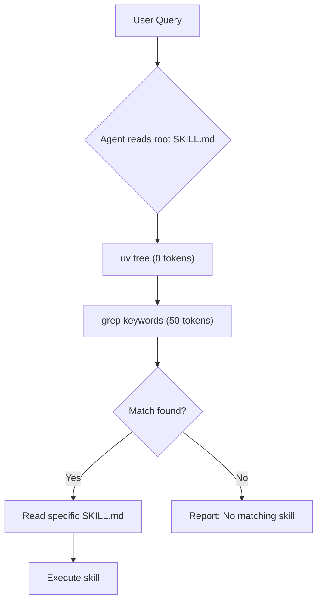

# Skill Builder

**A meta-skill for creating reusable, context-efficient agent skills.**

Build skills that execute reliably under cognitive constraints—like checklists pilots use in emergencies, but for AI agents with limited context windows.

---

## The Problem

LLM agents are brilliant but forgetful. Every complex task gets reinvented from scratch, burning tokens on reasoning that could be reused. When context windows fill up, quality degrades. When instructions are ambiguous, agents hallucinate procedures.

**Worse:** Traditional skill routers are themselves expensive. A router with 50 skills can consume 3000+ tokens just to pick the right one.

## The Solution

**Skill Builder** generates structured `SKILL.md` files using an object-oriented format designed for:

- **Fail-fast eligibility checks** — exit in ~150 tokens if skill doesn't apply
- **Lazy-loaded subclasses** — only load enhancements when needed
- **Explicit state management** — prevent infinite loops with trial counters
- **uv-based routing** — stop reinventing the router wheel, use proven dependency resolution

---

## Architecture

### Skill Structure (OOL)

```
MainExecution          ← Always loaded first (~500 tokens)
├── Constructor        ← Eligibility diagnosis (exit fast if wrong)
└── execute()          ← Minimum viable path

QualityOptimizer       ← Lazy-load when output quality is low
PerformanceOptimizer   ← Lazy-load when parallelization helps
ErrorHandler           ← Lazy-load when execution fails
```

Skills are **object-oriented procedures (OOL)**: the main class runs the shortest path, subclasses extend it on-demand. A model with 2K context can execute the core; a model with 32K can load all enhancements.

### Routing (uv)

Instead of a custom router that burns tokens:

```bash
# Traditional router: 3000 tokens for 50 skills
grep -r "compatibility" skills/*/SKILL.md | agent_parse

# uv router: 0 tokens, instant
uv tree --depth 1
grep -r "keywords.*brainstorming" skills/*/pyproject.toml
```

**Why uv?**
- Zero token cost (native tool)
- Proven dependency resolution
- Automatic conflict handling
- Version compatibility built-in
- Graph-based optimization

---

## Usage

### For Agent Users

**Finding a skill:**
```bash
# See all available skills
uv tree --depth 1

# Search by keyword
grep -r "brainstorming" skills/*/pyproject.toml

# Check dependencies
uv tree design-thinking-ideation
```

**Activating a skill:**
```python
# Agent reads root SKILL.md, which says:
# "Use uv to find skills. They're in skills/*/SKILL.md"

# Agent searches
result = terminal.execute("grep -r 'keywords.*brainstorming' skills/*/pyproject.toml")

# Agent activates
skill_path = extract_path(result)  # skills/design-thinking-ideation/
skill_content = filesystem.read(f"{skill_path}/SKILL.md")
execute(skill_content)
```

### For Skill Authors

**Create a new skill:**

1. Use the skill-builder pipeline:
```bash
# 1. Research the skill
gemini --file meta/researcher.md

# 2. Compile to SKILL.md
gemini --file meta/compiler.md

# 3. Quality check
gemini --file meta/quality-assurance.md
```

2. Place output in `skills/your-skill-name/`:
```
skills/your-skill-name/
├── pyproject.toml      # Dependencies + agent skills metadata
├── SKILL.md            # MainExecution class
└── resources/          # Optional subclasses
    ├── quality.md
    └── performance.md
```

3. Your skill is now discoverable via uv

**Skill template:**

Use `meta/template.md` as your starting point. Key sections:

- **Frontmatter**: Metadata for routing (keywords, exit conditions)
- **Constructor**: Fast eligibility checks
- **execute()**: Minimum viable execution path
- **Subclasses**: Optional enhancements (in `resources/`)

### For Migration from Old Format

If you have existing SKILL.md files:

```bash
python scripts/migrate_to_uv.py
uv sync
uv tree  # Verify
```

---

## Example: Design Thinking Ideation

**pyproject.toml:**
```toml
[project]
name = "design-thinking-ideation"
version = "1.0.0"
description = "Generate divergent solution concepts from problem statements"
dependencies = []  # Self-contained

[tool.agentskills]
keywords = [
    "brainstorming",
    "divergent-thinking",
    "ideation"
]

exit_when = [
    "Problem statement missing",
    "User wants convergent solution",
    "Time constraint under 5min"
]
```

**SKILL.md:**
```markdown
## Constructor: __init__(context)

# Fail-fast checks
IF NOT problem_statement:
    EXIT "Problem statement required"

IF context contains "solution":
    EXIT "Use 'problem-solving' skill instead"

IF time < 5min:
    EXIT "Use 'quick-brainstorm' skill"

PROCEED
```

**Agent discovery:**
```bash
$ grep -r "ideation" skills/*/pyproject.toml
skills/design-thinking-ideation/pyproject.toml:    "ideation",

$ uv tree design-thinking-ideation
design-thinking-ideation v1.0.0
(no dependencies)
```

---

## Skill Discovery Flow



**Token efficiency:** 
- Router: 0 tokens (native tool)
- Search: ~50 tokens (grep + parsing)
- Activation: Skill-specific (~500-2000 tokens)

**Traditional router:** 3000+ tokens just to pick a skill

---

## Compatibility

| Platform | Support |
|----------|----------|
| [Gemini CLI](https://geminicli.com) | Native skill loading |
| [Claude Code](https://claude.ai) | Via MCP server |
| [OpenAI Codex](https://openai.com) | Custom instructions |
| [Agent Skills Protocol](https://agentskills.io) | Full compliance |

**MCP Tools Supported:**
- `github-mcp` — repository operations
- `filesystem` — local file access
- `terminal` — command execution (for uv)

---

## Repository Structure

```
skill-builder/
├── SKILL.md                  # Root router (just says "use uv")
├── pyproject.toml            # Workspace definition
├── uv.lock                   # Locked dependency graph
├── README.md
│
├── meta/                     # Skill-builder tooling
│   ├── researcher.md         # Step 1: Research skill
│   ├── compiler.md           # Step 2: Compile to template
│   ├── quality-assurance.md  # Step 3: Validate output
│   └── template.md           # OOL skill template
│
├── scripts/
│   └── migrate_to_uv.py      # Convert old format to uv
│
└── skills/                   # Community skill library
    ├── dependency-tree/      # Meta-skill for dependency viz
    │   ├── pyproject.toml
    │   └── SKILL.md
    │
    └── design-thinking-ideation/
        ├── pyproject.toml
        └── SKILL.md
```

---

## Template Philosophy

### Why Object-Oriented?

| Procedural Skills | OOL Skills |
|-------------------|------------|
| Load entire procedure upfront | Load main class first |
| All steps in one file | Subclasses in separate files |
| No clear exit points | Constructor handles eligibility |
| Token cost: fixed | Token cost: scales with need |

### Why Fail-Fast?

Inspired by aviation checklists: when something's wrong, you need to know *immediately*—not after reading 3000 tokens of procedure.

```yaml
compatibility:
  exit_when:
    - "No problem statement provided"      # Catches 60%
    - "Problem already has clear solution" # Catches 30%  
    - "Requires real-time user feedback"   # Catches 10%
```

The model reads these three checks, evaluates against current context, and exits in under 200 tokens if the skill doesn't fit.

### Why Trial Counters?

Agents get stuck in loops. The template enforces:

```python
IF trial_count >= 5 OR cannot_remember_count:
    cache_artifacts()
    EXIT with partial_result
```

No more infinite recursion burning through context.

### Why uv?

Because **stop reinventing the pip wheel**. Package managers solved dependency resolution optimally decades ago. Why build a custom router when uv:

- Resolves dependencies in milliseconds
- Handles version conflicts automatically
- Provides graph visualization (`uv tree`)
- Costs zero tokens (it's a native tool)
- Scales to thousands of skills without slowdown

---

## Contributing

### Add a New Skill

1. Fork this repo
2. Create `skills/your-skill-name/`
3. Add `pyproject.toml` + `SKILL.md` using template
4. Test with at least 2 different LLM providers
5. Submit PR with skill + test results

### Improve the Template

The template lives in `meta/template.md`. Changes should:
- Reduce token cost without losing structure
- Improve semantic search hit rate
- Maintain compatibility with Agent Skills spec

### Report Issues

Found a bug in a skill? Open an issue with:
- Skill name
- Agent platform (Gemini/Claude/GPT)
- Expected vs actual behavior
- Steps to reproduce

---

## References

- [Agent Skills Specification](https://agentskills.io/specification)
- [Gemini CLI Skills Documentation](https://geminicli.com/docs/cli/skills/)
- [Model Context Protocol](https://modelcontextprotocol.io/docs)
- [uv Documentation](https://docs.astral.sh/uv/)

---

## License

MIT — use it, fork it, make agents that actually remember how to do things.

---

<p align="center">
  <i>Stop reinventing the pip wheel. Start using the uv skill.</i>
</p>
